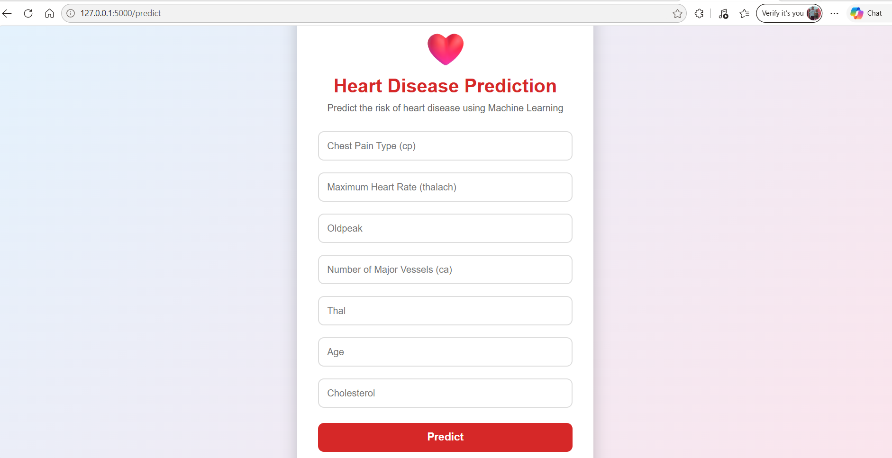
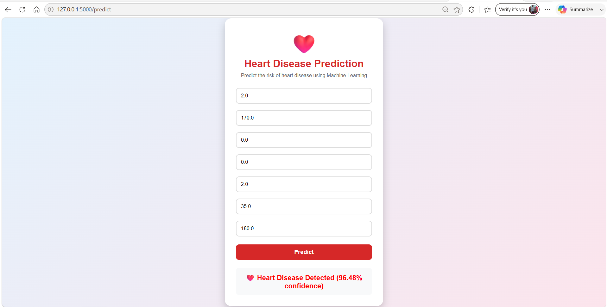
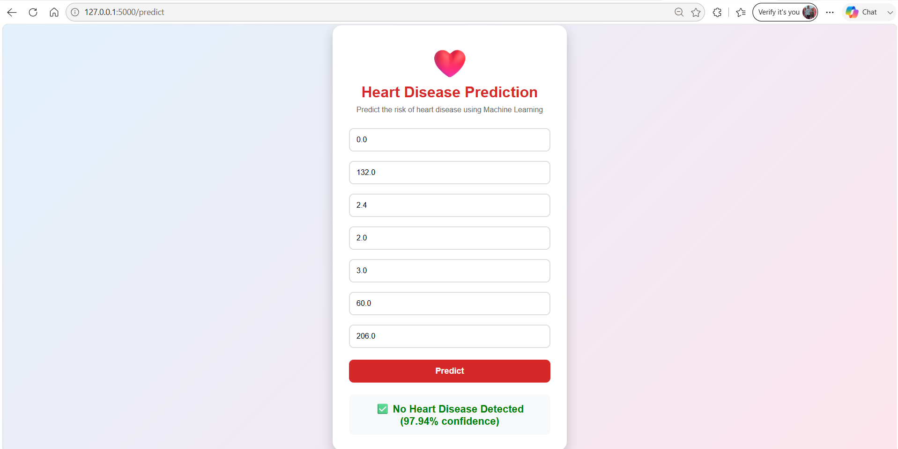

# Heart Disease Risk Prediction System using Machine Learning

A Machine Learning web application that predicts the likelihood of heart disease using Logistic Regression and Flask.

## Project Highlights

- Accuracy: 80.7%
- Logistic Regression Model
- Flask Web Application
- Responsive UI Design
- Confidence Score Prediction
- Heartbeat Animation

## 📌 Overview

This is a  Machine Learning web application that predicts the likelihood of heart disease based on patient medical information. The model is built using Logistic Regression and deployed using Flask.

## 🛠 Technologies Used

- Python
- Pandas
- NumPy
- Scikit-Learn
- Flask
- HTML
- CSS
- Pickle

## 📊 Features Used

- Chest Pain Type (cp)
- Maximum Heart Rate (thalach)
- Oldpeak
- Number of Major Vessels (ca)
- Thal
- Age
- Cholesterol (chol)

## 🤖 Model Information

- Algorithm: Logistic Regression
- Feature Scaling: StandardScaler
- Accuracy: 80.7%

## 🚀 How to Run

1. Install dependencies

```bash
pip install -r requirements.txt
```

2. Run the application

```bash
python app.py
```

3. Open in browser

```text
http://127.0.0.1:5000
```

## 📸 Application Screenshots

### 🏠 Home Page



### ❤️ Heart Disease Detected



### ✅ No Heart Disease Detected



## 👩‍💻 Author

**Sowmiya**

B.E. Computer Science and Engineering
